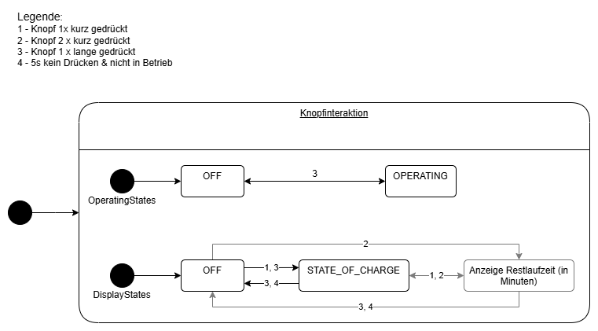

# Design

## Klassendiagramm

## Zustandsdiagramm Knopfinteraktion

## Sequenzdiagramm 

## Designpatterns

| Klasse            | Design-Pattern        | Grund                         |
|-------------------|------------------------|-------------------------------|
| SettingsStorage  | Singleton  | gewährleistet zentralen und konsistenten Zugriff auf gespeicherte Werte   |
| InteractionHandler | Command | leichtere Erweiterbarkeit und Wartbarkeit, Commands können getestet und protokolliert werden ohne den Handler zu verändern |
