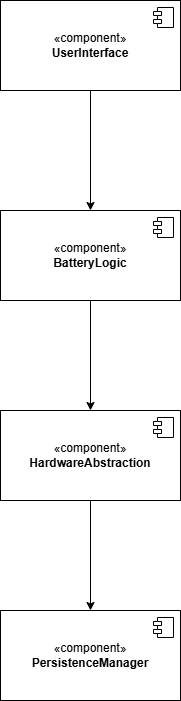

# Architektur

## Architekturmuster festlegen

**Schichtenarchitektur**: 

- Trennung der Verantwortlichkeiten (Hardwarenahe-Funktionen wie Spannung messen, Anwendungslogik wie Kalibrierung und Ladezustandsberechnung, Benutzeroberfläche)
- Jede Schicht ist unabhängig testbar und austauschbar
- Segmente nach funktionaler Rolle gruppiert -> Kapselung und Entkopplung der Anwendung
- Jede Schicht darf nur die direkt darunterliegende Schicht ansprechen.
-Es gibt keine Rückwärtssprünge oder Querkommunikation.

## Komponentendiagramm erstellen

## Schnittstellendefinition

| **Quelle**      | **Ziel**              | **Schnittstellen**                                           |
| --------------- | --------------------- | ------------------------------------------------------------ |
| `UserInterface` | `BatteryLogic`        |  [getStateOfCharge()]()               |
| `BatteryLogic` | `HardwareAbstraction` |  |      |
| `HardwareAbstraction`  | `PersistenceManager`  |    |
