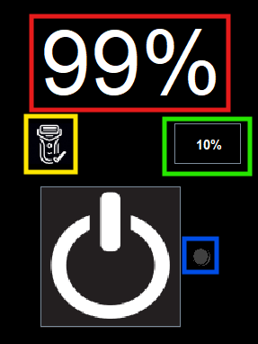

## **1. Anzeigeelemente**

#### **Display (rot)**

Das Display kann zwischen zwei zentralen Informationsbereichen wechseln:

* **State of Charge (SoC) Anzeige**
  Zeigt den aktuellen Ladezustand des Akkus in Prozent an.
  *Beispiel: „75 %“ bedeutet, dass der Akku zu 75 % geladen ist.*

* **Remaining Runtime Anzeige**
  Gibt an, wie viele Minuten der Rasierer bei durchgehendem Betrieb mit dem aktuellen Akkustand noch verwendet werden
  kann.
  *Beispiel: „12 Min“ bedeutet, dass der Rasierer noch 12 Minuten laufen kann, bevor der Akku leer ist.*

#### **LED-Anzeige (blau)**

Die farbige LED signalisiert den aktuellen Lade- bzw. Betriebszustand des Geräts über verschiedene Blinkmuster:

| LED-Zustand                 | Bedeutung                                                                                                    |
|-----------------------------|--------------------------------------------------------------------------------------------------------------|
| **Schnell rot blinkend**    | Akkustand unterhalb der eingestellten Warnschwelle (SoC-Warnung aktiv).                                      |
| **Dauerhaft rot blinkend**  | Kritische Unterspannung des Akkus (< 2,8 V); das Gerät wechselt in den Stromsparmodus. Kein Betrieb möglich. |
| **Langsam gelb blinkend**   | Der Akku wird derzeit geladen. Kein Betrieb möglich.                                                         |
| **Dauerhaft blau blinkend** | Akku ist vollständig geladen; Ladekabel ist noch angeschlossen (Ladeschutz aktiv). Kein Betrieb möglich.     |
| **LED aus**                 | Kein besonderer Zustand liegt vor.                                                                           |

#### **Rasur möglich-Signal (gelb)**

Eine Statusanzeige, die signalisiert, ob mit dem aktuellen Ladezustand mindestens eine vollständige Rasur (ca. 5
Minuten) möglich ist.
*Leuchtet das Signal, kann eine Rasur sicher durchgeführt werden.*

#### **Warnschwellen-Umschaltknopf (grün)**

Ein Umschalt-Knopf, der die aktuell eingestellte SoC-Warnschwelle (z. B. „30 %“) anzeigt.

## **2. Bedienschnittstellen**

#### **PowerButton**

Der zentrale Bedienknopf erfüllt zwei verschiedene Funktionen, je nach Dauer des Tastendrucks:

* **Kurz drücken**
  Wechselt zyklisch zwischen den Anzeigemodi des Displays:

    * Ausgeschaltet → SoC-Anzeige (State of Charge)
    * SoC-Anzeige → Anzeige der verbleibenden Restlaufzeit
    * Restlaufzeit-Anzeige → zurück zur SoC-Anzeige

* **Lang drücken (ca. 2 Sekunden)**
  Schaltet das Gerät zwischen den Betriebsmodi um:

    * Gerät ist aus → wird eingeschaltet (Betriebsmodus)
    * Gerät ist an → wird ausgeschaltet

#### **Warnschwellen-Umschaltknopf (grün markiert in UI Bild)**

Über diesen Knopf kann die Warnschwelle für den Akkustand manuell angepasst werden:

* **Drücken**

    * Aktuell 10 % → wird auf 30 % gesetzt
    * Aktuell 30 % → wird auf 10 % gesetzt

Der eingestellte Wert wird auf dem Knopf angezeigt und beeinflusst, ab wann die rot blinkende LED-Warnung aktiviert wird.

#### **Konsoleneingabe (für Ladeoperationen)**

Die Ladevorgänge des Geräts lassen sich über einfache Konsoleneingaben steuern:

* **Eingabe `start`**
  Startet den Ladevorgang. Die gelbe LED beginnt langsam zu blinken.

* **Eingabe `stop`**
  Beendet den Ladevorgang. Die LED erlischt, sofern kein anderer Lade- oder Akkuzustand aktiv ist.
