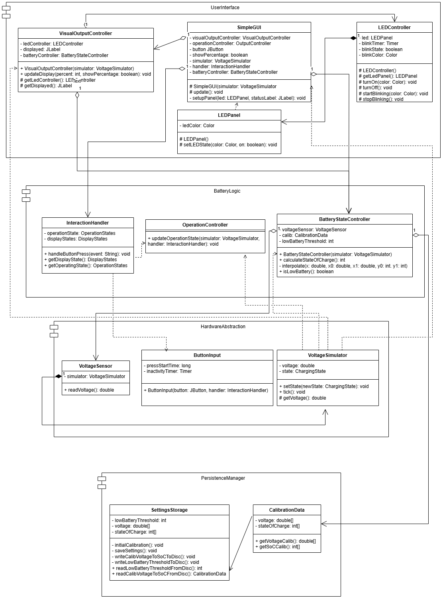
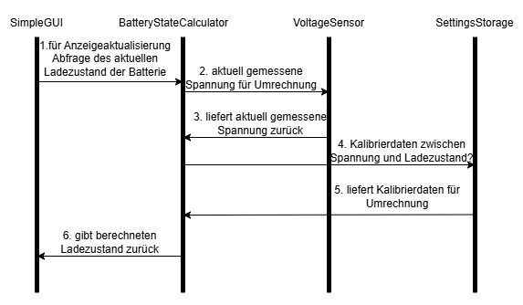

# Design

## Klassendiagramm

Das Klassendiagramm wurde zuerst mit einem ersten Wurf erstellt, um eine erste Idee an Klassenstruktur festzuhalten.
Dieser erste Entwurf wurde leider nicht zwischengespeichert. Enthalten waren folgende Klassen: VisualOutputController,
InteractionHandler, CalibrationManager, BatteryStateController, VoltageSensor, ButtonInput, Display Driver,
SettingsStorage und LogData. Im Verlauf der Implementierung haben sich weitere essenzielle Klassen ergeben, andere haben
sich als überflüssig erwiesen und bei vielen wurden viele Attribute und Methoden angepasst bzw. hinzugefügt. Das daraus
resultierende Klassendiagramm ist in der Abbildung unten zu sehen.

Das Klassendiagramm enthält alle Methoden und Attribute (sowohl public als auch private), damit die Struktur des Codes
und die Interaktion zwischen den Klassen klar ersichtlich ist. Die Sichtbarkeit der Attribute und Methoden ist 
entsprechend der Konventionen angegeben. Das einzige, was nicht berücksichtigt wurde, sind Enums und Hilfsklassen zur 
Umsetzung der Designpatterns.

## Zustandsdiagramm Knopfinteraktion

## Sequenzdiagramm Spannungsmessung zu Anzeige

## Designpatterns

Das Design-Pattern Singleton für die Klasse SettingsStorage war von Beginn an geplant, während sich das Design-Pattern
Command im Verlauf der Implementierung als sinnvoll herausgestellt hat. Das Command-Pattern wurde für die Klasse
InteractionHandler implementiert, um die Interaktion mit dem Benutzer zu abstrahieren und zu vereinfachen.

| Klasse             | Design-Pattern | Grund                                                                                                                      |
|--------------------|----------------|----------------------------------------------------------------------------------------------------------------------------|
| SettingsStorage    | Singleton      | gewährleistet zentralen und konsistenten Zugriff auf gespeicherte Werte                                                    |
| InteractionHandler | Command        | leichtere Erweiterbarkeit und Wartbarkeit, Commands können getestet und protokolliert werden ohne den Handler zu verändern |
