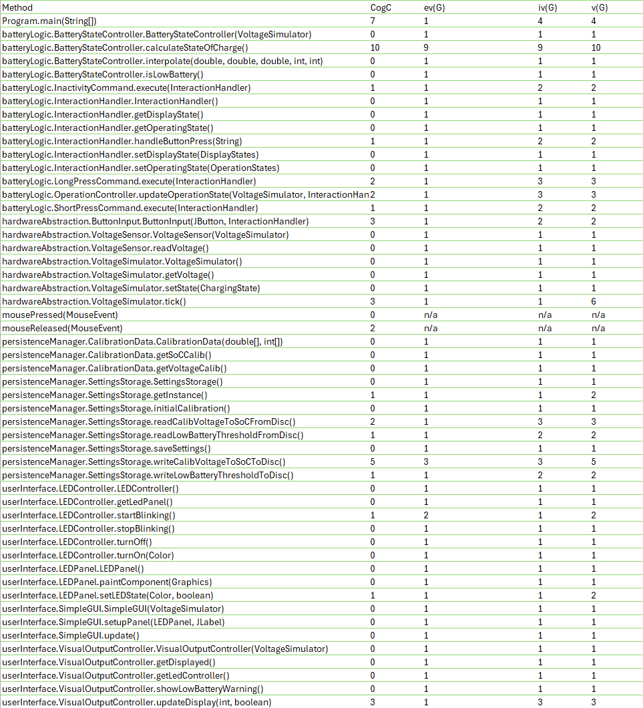
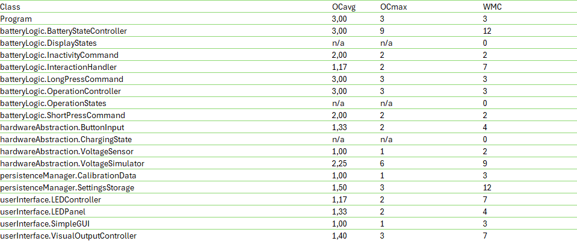
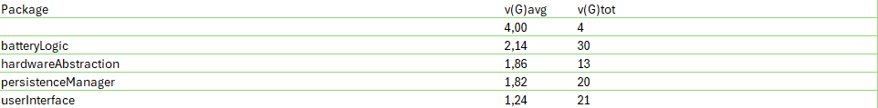

# Implementierung

Entscheidung gegen Branches, da kein Deployment, keine wirklich großen Teilfunktionalitäten und Arbeit alleine.

## Traceability-Matrix

| Requirement-ID | Jira-Issue | Komponente                         | Klasse(n)                             | Schnittstelle(n)                | Testfall(e) |
|----------------|------------|------------------------------------|---------------------------------------|---------------------------------|-------------|
| 1.1            | BAT-7      | batteryLogic, hardwareAbstraction  | `VoltageSensor`                       | readVoltage()                   | BB1         |
| 1.2            | BAT-8      | batteryLogic                       | `BatteryStateController`              | calculateStateOfCharge()        | UT3         |
| 1.3            | BAT-9      | batteryLogic                       | `BatteryStateController`              | getDisplayState()               | UX1         |
| 2.1            | BAT-10     | userInterface                      | `SimpleGUI`                           | getDisplayState()               | BB2         |
| 2.2            | BAT-11     | userInterface, hardwareAbstraction | `ButtonInput`, `InteractionHandler`   | ButtonInput()                   | BB4         |
| 2.4            | BAT-13     | userInterface                      | `SimpleGUI`                           |                                 |             |
| 2.5            | BAT-14     | userInterface, hardwareAbstraction | `InteractionHandler`                  | setState()                      | BB3         |
| 2.6            | BAT-15     | userInterface                      | `SimpleGUI`                           |                                 | UX3         |
| 2.7            | BAT-16     | userInterface                      | `SimpleGUI`                           |                                 | UX2         |
| 2.8            | BAT-17     | userInterface                      | `SimpleGUI`                           |                                 |             |
| 2.9            | BAT-18     | userInterface                      | `SimpleGUI`                           |                                 | UX4         |
| 2.10           | BAT-19     | userInterface                      | `SimpleGUI`                           | getDisplayState()               | BB5         |
| 3.1            | BAT-20     | persistenceManager                 | `SettingsStorage`, `VoltageSimulator` | calculateStateOfCharge()        | UT1, UT2    |
| 3.2            | BAT-21     | persistenceManager                 | `SettingsStorage`                     | readCalibVoltageToSoCFromDisc() |             |

## Code-Metriken

### Methodenmetriken

Die Methodenmetriken zeigen insgesamt ein positives Bild: Die meisten Methoden weisen niedrige Werte für kognitive
Komplexität (CogC), zyklomatische Komplexität (v(G)) sowie strukturelle Metriken wie ev(G) und iv(G) auf. Dies spricht
für einen klar strukturierten, gut wartbaren und einfach testbaren Code.
Eine Ausnahme stellt jedoch die Methode calculateStateOfCharge() dar. Die Werte deuten darauf hin, dass die Methode zu
viele Verzweigungen und Wiederholungen enthält, was die Lesbarkeit und Wartbarkeit erheblich einschränkt. Ursache ist
vor allem die wiederholte Abfrage von Spannungsbereichen mittels if-else-Konstrukten auf fest indexierten Arrays.
Die Methode wurde daher überarbeitet: Statt mehrfacher Verzweigungen wird nun eine Schleife verwendet, die die
Kalibrierungspunkte dynamisch verarbeitet. Dadurch wird die Komplexität reduziert, die Methode ist robuster gegenüber
Änderungen und besser testbar.

### Klassenmetriken

Die Klassenmetriken zeigen die durchschnittliche Komplexität (OCavg) aller Methoden in einer Klasse, die höchste
Einzelkomplexität (OCmax) und die Summe aller Methodenkomplexitäten pro Klasse (WMC) an. Insbesondere nach der Anpassung
von calculateStateOfCharge() sind die Werte für alle Klassen im grünen Bereich, was für die Modularität und Wartbarkeit
des Codes spricht.

### Package Metriken

Die Packagemetriken zeigen die durchschnittliche Komplexität pro Methode (v(G)avg) und die Summer der Komplexitäten
aller Methoden eines packages. Die Werte sind insgesamt im grünen Bereich.

### Modulmetriken

Siehe Packagemetriken.
