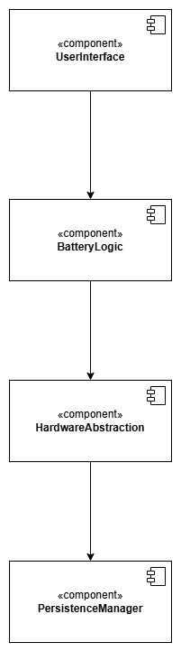

# Architektur

## Komponentendiagramm

| **Komponente**      | **Requirements**                                                                                                                             | **Jira-Referenzen**                                                                                            |
|---------------------|----------------------------------------------------------------------------------------------------------------------------------------------|----------------------------------------------------------------------------------------------------------------|
| userInterface       | Req. 2.1, Req. 2.2, Req. 2.4, Req. 2.5, Req. 2.6, Req. 2.7, Req. 2.8, Req. 2.9, Req. 2.10, Req. 4.1, Req. 4.3, Req. 5.1, Req. 5.2, Req. 5.3, | BAT-10, BAT-11, BAT-13, BAT-14, BAT-15, BAT-16, BAT-17, BAT-18, BAT-19, BAT-26, BAT-27, BAT-29, BAT-30, BAT-31 |
| batteryLogic        | Req. 1.1, Req. 1.2, Req. 1.3, Req. 4.1, Req. 5.1, Req. 5.2, Req. 5.3, Req. 5.4, Req. 5.6, Req. 6.2, Req. 6.3                                 | BAT-7, BAT-8, BAT-9, BAT-26, BAT-29, BAT-30, BAT-31, BAT-32, BAT-34, BAT-36, BAT-37                            |
| hardwareAbstraction | Req. 1.1, Req. 2.2, Req. 2.5, Req. 5.4, Req. 6.2, Req. 6.3                                                                                   | BAT-7, BAT-11, BAT-14, BAT-32, BAT-36, BAT-37                                                                  |
| persistenceManager  | Req. 3.1, Req. 3.2                                                                                                                           | BAT-20, BAT-21                                                                                                 |

**Verantwortlichkeiten der Komponenten:**

| **Komponente**          | **Rolle**                  | **Verantwortlichkeiten**                                            |
|-------------------------|----------------------------|---------------------------------------------------------------------|
| **UserInterface**       | Präsentationsschicht       | Anzeige von Zuständen, LED-Steuerung, Barrierefreiheit, Interaktion |
| **BatteryLogic**        | Business-Logik             | Ladezustand berechnen, Warnungen verwalten, Logik zu Ladevorgängen  |
| **HardwareAbstraction** | Hardware-Interface         | Zugriff auf Sensoren, Ladezustände, LEDs abstrahieren               |
| **PersistenceManager**  | Speicher- / Konfig-Schicht | Kalibrierung, Spannungsreferenz, persistente Werte speichern/laden  |

## Schnittstellendefinition

| **Ziel**              | **Quelle**            | **Schnittstellen**                                                                                                                                                                                                                                                                                                                                                                                                                                                                                                                                                                                                                                                                                                                                                        |
|-----------------------|-----------------------|---------------------------------------------------------------------------------------------------------------------------------------------------------------------------------------------------------------------------------------------------------------------------------------------------------------------------------------------------------------------------------------------------------------------------------------------------------------------------------------------------------------------------------------------------------------------------------------------------------------------------------------------------------------------------------------------------------------------------------------------------------------------------|
| `userInterface`       | `batteryLogic`        | [updateOperationState()](../referenziert/Architektur/Schnittstellendokumentation.md#methode-updateoperationstate), [getDisplayState()](../referenziert/Architektur/Schnittstellendokumentation.md#methode-getdisplaystate), [calculateStateOfCharge()](../referenziert/Architektur/Schnittstellendokumentation.md#methode-calculatestateofcharge), [getChargingState()](../referenziert/Architektur/Schnittstellendokumentation.md#methode-getchargingstate), [isLowBattery()](../referenziert/Architektur/Schnittstellendokumentation.md#methode-islowbattery), [readVoltage()](../referenziert/Architektur/Schnittstellendokumentation.md#methode-readvoltage), [setDisplayState()](../referenziert/Architektur/Schnittstellendokumentation.md#methode-setdisplaystate) |
| `userInterface`       | `hardwareAbstraction` | [ButtonInput()](../referenziert/Architektur/Schnittstellendokumentation.md#methode-buttoninput), [setLEDState()](../referenziert/Architektur/Schnittstellendokumentation.md#methode-setledstate)                                                                                                                                                                                                                                                                                                                                                                                                                                                                                                                                                                          |
| `batteryLogic`        | `hardwareAbstraction` | [readVoltage()](../referenziert/Architektur/Schnittstellendokumentation.md#methode-readvoltage), [setState()](../referenziert/Architektur/Schnittstellendokumentation.md#methode-setstate), [getChargingState()](../referenziert/Architektur/Schnittstellendokumentation.md#methode-getchargingstate), [readTemperature()](../referenziert/Architektur/Schnittstellendokumentation.md#methode-readtemperature), [handleButtonPress()](../referenziert/Architektur/Schnittstellendokumentation.md#methode-handlebuttonpress)                                                                                                                                                                                                                                               |
| `batteryLogic`        | `persistenceManager`  | [readCalibVoltageToSoCFromDisc()](../referenziert/Architektur/Schnittstellendokumentation.md#methode-readcalibvoltagetosocfromdisc), [readLowBatteryThresholdFromDisc()](../referenziert/Architektur/Schnittstellendokumentation.md#methode-readlowbatterythresholdfromdisc), [readTempThresholdsFromDisc()](../referenziert/Architektur/Schnittstellendokumentation.md#methode-readtempthresholdfromdisc)                                                                                                                                                                                                                                                                                                                                                                |
| `hardwareAbstraction` | `persistenceManager`  | [loadCalibrationData()](../referenziert/Architektur/Schnittstellendokumentation.md#methode-loadcalibrationdata)                                                                                                                                                                                                                                                                                                                                                                                                                                                                                                                                                                                                                                                           |
| `Programm`            | alle                  | [tick()](../referenziert/Architektur/Schnittstellendokumentation.md#methode-tick), [update()](../referenziert/Architektur/Schnittstellendokumentation.md#methode-update), [listenForChargingCommands()](../referenziert/Architektur/Schnittstellendokumentation.md#methode-listenforchargingcommands)                                                                                                                                                                                                                                                                                                                                                                                                                                                                     |
