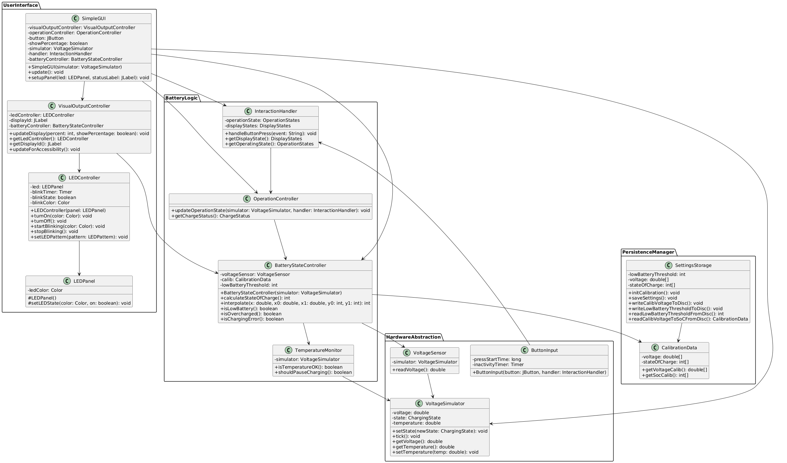
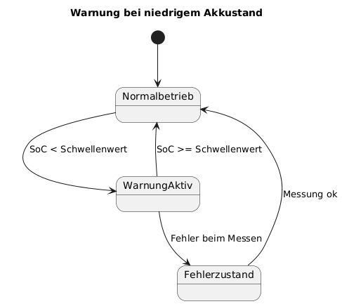

# Design

## Designentscheidungen

**Farbwahl Anzeige:**

- Display (Teilfunktionalität 2): weiße Schrift auf schwarzem Hintergrund -> maximaler Kontrast
- Warnung (Teilfunktionalität 4): rot -> kulturell etablierte Warnfarbe (aber schlecht erkennbar bei Farbsehschwäche)
- Ladeaktivität (Teilfunktionalität 5): gelb -> gut unterscheidbar von rot, deutet Übergang zwischen Akku leer (rot) und
  Akku voll (typisch grün) an
- Ladeabschluss (Teilfunktionalität 5): blau -> für nahezu alle Formen der Farbsehschwäche gut erkennbar

**Anzeigedesign Ladeaktivität:**

LED leutet während Ladeaktivität durchgehend gelb. Auf Knopfdruck kann die Ladezustandsanzeige aktiviert werden. Der
Rasierer lässt sich während der Ladeaktivität allerdings nicht einschalten

**Anzeigedesign Ladeende:**

LED blinkt langsam in blau (solange das Ladekabel noch dran ist). Anschalten nicht möglich, solange Kabel noch
verbunden, aber Ladezustandsanzeige kann über Knopfdruck abgerufen werden.

**Ladefehler und wie diese angezeigt werden:**

- Temperaturüberschreitung: kein Weiterladen (Ladevorgang pausieren), dabei keine besondere Anzeige (LED zeigt weiterhin
  Ladevorgang an und es wird normal weitergeladen, wenn Temperatur wieder ok)
- keine Eingangsspannung erkannt (z.B. wegen defektem Ladekabel): LED zeigt keine Ladeaktivität an

**Eingangssignal für Ladeerkennung:**

in Realität: Eingangssignal von Ladegerät (Adapter) über Kabel

hier: Eingabe über Kommandozeile zum Simulieren von Ladekabel eingesteckt / Ladekabel ausgesteckt ("Start", "Stopp")

**energieeffizientes Design der Ladeanzeige:**

LED und keine zusätzliche Anzeige

**Option für multisensorische Warnsignale bei niedrigem Akkustand:**

sinnvoll visuell und bei Zustandsübergang (Warnschwelle) einmal ein akustisches Signal

-> Der User bekommt die Warnung wegen niedrigem Ladezustand auf jeden Fall mit & gerade für Barrierefreiheit sind
multisensorische Signale unerlässlich.

**Überladeschutzlogik:**

- wenn man einen Akku zu lange lädt, altert er schneller und verliert dadurch an Lebensdauer
  -> wenn 100 % aufgeladen sind, wird nicht mehr geladen (auch wenn Ladegerät weiterhin eingesteckt).

**Temperatursimulator:**

- Temperatursensor nötig
- Standardbetriebstemperatur: 25 +/- 2°C (als Defaultparameter übergeben, aber für Tests manuelles festlegen möglich)
- Standardladetemperatur: 20-30° (siehe Betriebstemperatur)

**Regeln Verhalten bei Temperaturänderungen:**

- < 15°C und > 45°C: Betrieb des Rasierers ausschalten oder Ladevorgang anhalten bis passende Temperatur erreicht ist

## Klassendiagramm

Umstieg auf Plant-UML für Klassendiagramme, da nach Implementierung automatisch aus Entwicklungsumgebung zu erzeugen.

## Zustandsdiagramm Warnung

## Sequenzdiagramm Auslösen der Warnung

## Zustandsdiagramm zu Ladezuständen

## Sequenzdiagramm vollständige Ladung

## Designpatterns

| Klasse                   | Design-Pattern | Grund                                                                                                                      |
|--------------------------|----------------|----------------------------------------------------------------------------------------------------------------------------|
| `SettingsStorage`        | Singleton      | Gewährleistet zentralen und konsistenten Zugriff auf gespeicherte Werte                                                    |
| `InteractionHandler`     | Command        | Leichtere Erweiterbarkeit und Wartbarkeit, Commands können getestet und protokolliert werden ohne den Handler zu verändern |
| `BatteryStateController` | Observer       | Notifiziert andere Komponenten (LED, GUI), wenn sich Ladezustand oder Fehlermeldungen ändern                               |
| `VisualOutputController` | Observer       | Reagiert auf Änderungen im Ladezustand, z. B. um Anzeige zu aktualisieren                                                  |
| `LEDController`          | Observer       | Blinkt oder ändert Farbe, wenn sich Ladeaktivität oder Fehlerstatus ändert                                                 |
| `SimpleGUI`              | Observer       | Aktualisiert Textanzeigen bei Änderungen im SoC oder Ladezustand                                                           |
| `VoltageSimulator`       | State          | Verwaltet Ladezustände wie `Charging`, `Idle`, `Overheated` – jeweils mit unterschiedlichem Verhalten                      |
| `OperationController`    | State          | System hat verschiedene Betriebsmodi (z. B. Laden, Anzeige, Fehler), die eigenes Verhalten ausprägen                       |

