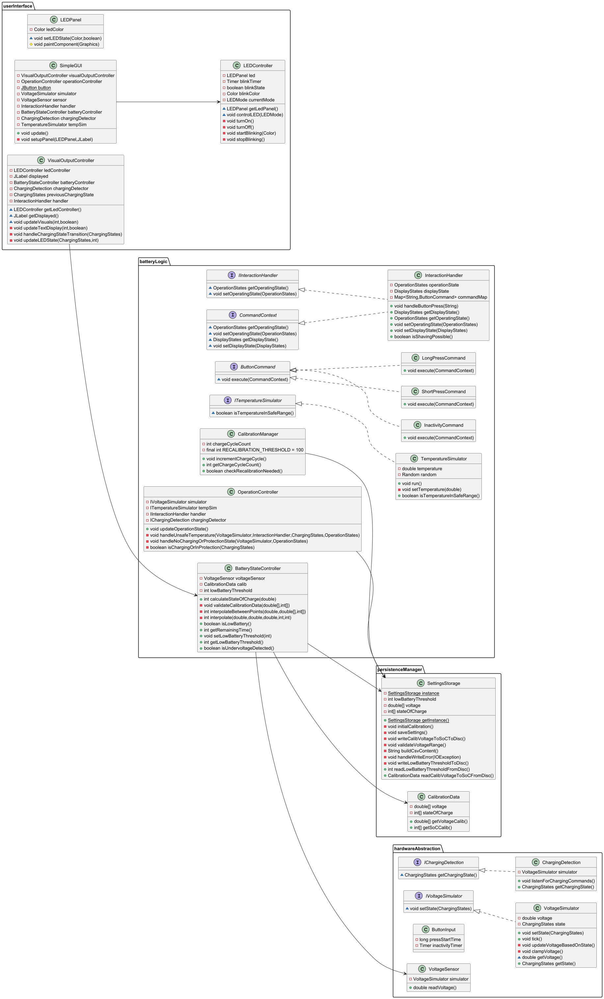
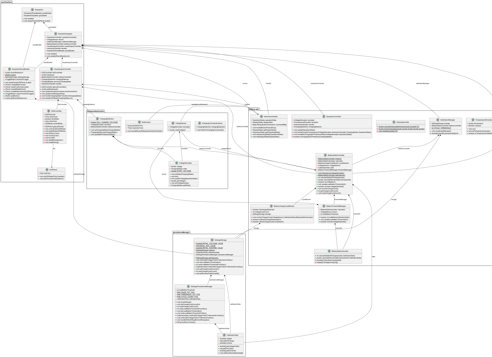
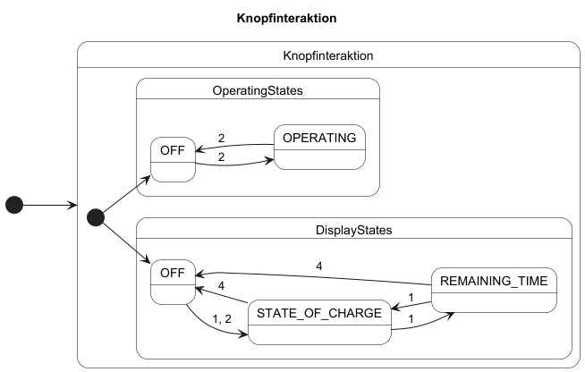
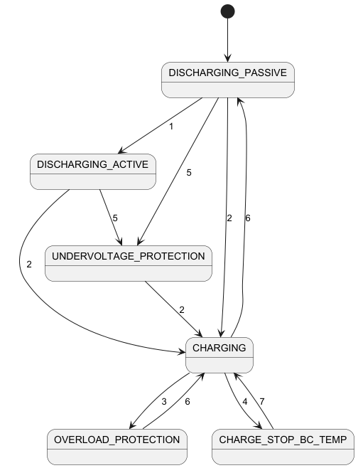
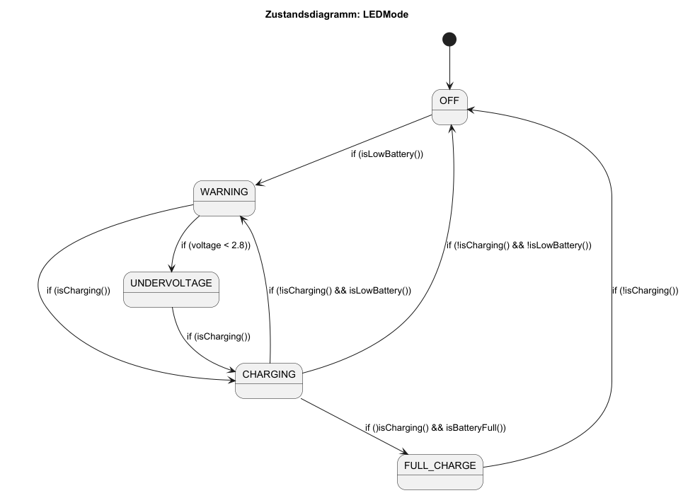

# Design

## Designentscheidungen

### UI-Konzept zur Einstellung der Warnschwelle

An einem realen Rasierer würde die Einstellung der Warnschwelle über einen Kippschalter oder Schieberegler erfolgen.
Damit kann dann sehr einfach zwischen den beiden geplanten Warnschwellen 10% und 30% umgeschaltet werden. Falls eine
genauere Einstellung geplant/gewünscht wäre, könnte ein Drehregler verwendet werden. All diese Benutzerschnittstellen
befinden sich idealerweise an der Seite des Geräts, um eine einfache Bedienung zu ermöglichen.

In diesem SW-Projekt ohne die Möglichkeit, eine physische Benutzerschnittstelle zu implementieren, wird die Einstellung
der Warnschwelle über einen JToggle Button in der GUI realisiert. Der Button kann zwischen den beiden Zuständen "10%"
und "30%" umgeschaltet werden. Die Einstellung wird in der Klasse `SettingsStorage` gespeichert und kann jederzeit
abgerufen werden.

### Bedingung dafür, dass eine Rasur möglich

Eine Rasur dauert in der Regel 5-10 Minuten. Daher ist eine Rasur möglich, wenn der Ladezustand des Akkus zwischen 10%
und 100% liegt. Das heißt, dass der Akku auf mindestens 10% geladen sein muss, um eine Rasur zu ermöglichen.

### Signal dafür, dass eine Rasur möglich ist

Einblenden eines Icons eines Rasierers mit einem Haken dran auf dem Display unter der Prozentanzeige.

### nach wie vielen Ladezyklen wird rekalibriert

Nach 250 Ladezyklen, da alle 1000 Ladezyklen die maximale Kapazität um 20% abnimmt. Das bedeutet, dass sie pro
Ladezyklus um 0,02% abnimmt. Um in der 5% Toleranz zu bleiben (Req. 3.4) muss daher alle 250 Ladezyklen die Umrechnung
der Spannung in die Restlaufzeit neu kalibriert werden. Die Kapazitätsabnahme wird vereinfacht als linearer Zusammenhang
angenommen.

## Klassendiagramm

Durch Analyse und darauf basierender Optimierung des Codes mussten einige Anpassungen in der Klassenhierarchie
vorgenommen werden. Zur Vereinfachung werden hier Interfaces, Enums und Hilfsklassen weggelassen.

## Zustandsdiagramm Knopfinteraktion

Legende:

* "1": 1× kurz gedrückt
* "2": 1× lang gedrückt
* "3": 5s kein Drücken && nicht in Betrieb | 1× lang gedrückt && in Betrieb

## Zustandsdiagramm ChargingStates inkl. Schutzmechanismen

## Zustandsdiagramm LEDMode

Legende:

* "1": Betrieb des Rasierers (OperationState = OPERATING)
* "2": Ladevorgang gestartet
* "3": Ladung voll (100%)
* "4": zu hohe Temperatur (>= 45°C)
* "5": kritische Unterspannung unterschritten (< 2,8 V) -> Aktion: Dauerleuchten LED in rot & in Stromsparmodus
* "6": Ladevorgang beendet (Kabel entfernt)
* "7": Temperatur in Ordnung (< 45°C)

## Designpatterns

| Klasse                   | Design-Pattern | Grund                                                                                                                                                                                              |
|--------------------------|----------------|----------------------------------------------------------------------------------------------------------------------------------------------------------------------------------------------------|
| `SettingsStorage`        | Singleton      | Gewährleistet zentralen und konsistenten Zugriff auf gespeicherte Werte                                                                                                                            |
| `InteractionHandler`     | Command        | Leichtere Erweiterbarkeit und Wartbarkeit, Commands können getestet und protokolliert werden ohne den Handler zu verändern                                                                         |
| `BatteryStateController` | Singleton      | Batteriezustand zentral und konsistent im gesamten System verwalten                                                                                                                                |
| `CalibManager`           | Singleton      | Da die Anzahl an Rekalibrierungen aufgrund von Overhead nicht persistent gespeichert wird, ist es essenziell, dass es nur eine Instanz gibt, die dementsprechend immer nur einen gültigen Wert hab |

nicht genutzte Designpatterns inkl. Begründung:

| Klasse                   | Design-Pattern | Grund                                                                                                                                                        |
|--------------------------|----------------|--------------------------------------------------------------------------------------------------------------------------------------------------------------|
| `BatteryStateController` | Observer       | unnötig und überkompliziert, da nur jeweils eine Klasse die Lesemethoden aufruft                                                                             |
| `VisualOutputController` | Observer       | einziger Aufrufer der isLowBattery() Methode, daher Beobachter überflüssig                                                                                   |
| `LEDController`          | Observer       | Anzeige wird direkt gesteuert (z.B. durch VisualOutputController) -> einfacher ohne Entkopplung                                                              |
| `SimpleGUI`              | Observer       | soll nicht auf Änderungen reagieren, sondern zentral die Initialisierung und Aktualisierung der GUI steuern und damit die Kontrolle über den Ablauf behalten |
| `VoltageSimulator`       | State          | reine Hilfsklasse -> überkompliziert diese nach dem Statepattern umzusetzen                                                                                  |
| `OperationController`    | State          | modelliert keinen eigenen Zustandsautomaten, sondern vermittelt nur zwischen Komponenten                                                                     |
| `CalibrationManager`     | Observer       | einziger Aufrufer ist SimpleGUI -> einfacher ohne Entkopplung                                                                                                |