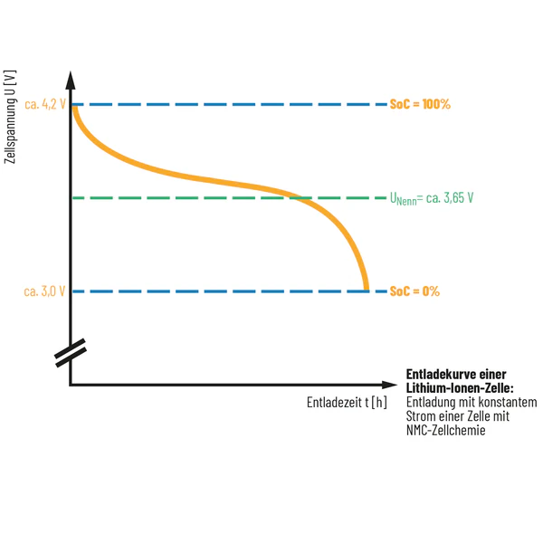

# Sprint 1

### Spannung der Batterie messen (Req. 1.1)

[Task: Spannungsmessmethode für Li-Ionen-Akku festlegen](https://uniprojectslara.atlassian.net/browse/BAT-38)

In Rasierapparaten werden in der Regel Lithium Ionen Akkus verwendet. Diese Akkus haben eine 100% Ladung bei ca. 4,2 V Spannung und eine 0% Ladung bei ca. 3 V. 

Intern misst ein Mikrocontroller die Spannung und rechnet diese anschließend in einen Prozentwert um.

### Spannungs-Ladekurve eines Lithium Ionen Akkus (Req. 1.2, Req. 3.1)

[Task: Recherche zur Spannungs-Ladezustands-Kurve](https://uniprojectslara.atlassian.net/browse/BAT-47)

An den Rändern, also in Bereichen von ca. 90% - 100% und 0% - 10% ist ein starker Spannungsanstieg / -abfall zu erkennen. Dort sorgen große Spannungsänderungen für kleinere Änderungen im Ladezustand. Im mittleren Bereich (20% - 80%) ist die Spannung recht stabil. Dort ist die Messung des Ladezustands ungenauer, da nur kleine Spannungsänderungen messbar sind. 

Mit steigendem Alter entlädt sich der Akku schneller, da der Akku immer weniger Energie speichern kann. Das Umrechnung der gemessenen Spannung in einen konkreten Ladezustand (repräsentiert mögliche Betriebsdauer) sollte alle 1-3 Monate neu kalibriert werden.

[Task: Definition Grenzwerte](https://uniprojectslara.atlassian.net/browse/BAT-87)

| SoC (%) | Spannung (V)    |
| ------- | --------------- |
| 100 %   | 4,20 V          |
| 80 %    | 4,00 V          |
| 50 %    | 3,75 V          |
| 20 %    | 3,50 V          |
| 0 %     | 3,00 V - 3,30 V |

[Spannungsverlauf 4,2 V Lithium-Ionen Batterie](https://batteryuniversity.com/article/bu-808-how-to-prolong-lithium-based-batteries)

*Bei Nennspannung von 3.75 V (nicht passend zu Abbildung s.o., diese gibt lediglich eine Orientierung für den Verlauf der Spannung abhängig von der Entladezeit).

### Entwurf der Berechnungsfunktion (Req. 1.2)

[Task: Entwurf der Berechnungsfunktion](https://uniprojectslara.atlassian.net/browse/BAT-48)

Zur Berechnung des Ladezustands in Prozent nutze ich als Ansatz eine Lookup-Tabelle (siehe oben) und Interpolation, um sinnvolle Werte auch zwischen den angegebenen zu erhalten. 

Mit fortschreitendem Alter der Batterie wird der Ladezustand in Prozent schneller abnehmen. Die Spannungs-Ladezustands-Kurve wird gestaucht. 

**Erkenntnis:** Die regelmäßige Kalibrierung wird nicht für die Umrechnung von Spannung in Ladezustand in Prozent benötigt, da der Spannungsrahmen und die zugehörigen Werte in Prozent erhalten bleiben. Das was regelmäßig durch einen Faktor angepasst werden muss ist die Umrechnung des Ladezustands in Prozent in die Restlaufzeit. Diese wird bei steigendem Alter für gleiche Ladezustände abnehmen.

### Triggerevents definieren (Req. 2.5)

[Task: Definition von Triggerevents](https://uniprojectslara.atlassian.net/browse/BAT-73)

1. Ein-/Ausschalten (Power-Button)
2. Moduswechsel (z. B. Rasier-/Trimmmodus)
3. Tastendruck (Menütaste, Lock-Taste etc.)
4. Andocken an Ladestation oder Trennen davon
5. Während Betrieb

### übliche Display-Helligkeit (Req. 2.7)

[Task: Definition Display-Helligkeit](https://uniprojectslara.atlassian.net/browse/BAT-79)

Die Einheit für Helligkeit bei Bildschirmen (Nits entspricht cd/m^2). Ein höherer Wert bedeutet, dass der Bildschirm heller ist. Für die meisten Anwendungen auf kleinen Displays sind Werte zwischen 200 und 500 Nits empfohlen. Um eine gute Lesbarkeit bei Tageslicht zu gewährleisten, aber gleichzeitig nicht zu grell im Dunkeln zu sein, liegt die Helligkeit des Displays zwischen 300 und 350 Nits.

### UI Gestaltung unter Beachtung von Farbenblindheit (Req. 2.8)

[Task: Recherche UI Gestaltung unter Beachtung von Farbenblindheit](https://uniprojectslara.atlassian.net/browse/BAT-82)

- Farbe nicht als einzige Information verwenden, höchstens zusätzlich
- Zahlenwerte (in Prozent) sind unabhängig von der Farbe verständlich
- Software zum testen der Anzeige: [Coblis - Color Blindness Simulator](https://www.color-blindness.com/coblis-color-blindness-simulator/)

### Mindestschriftgröße bei eingeschränktem Sehvermögen (Req. 2.9)

[Task: Mindestschriftgröße definieren](https://uniprojectslara.atlassian.net/browse/BAT-83)

Ein großer Teil der Zielgruppe ist schon älter und hat eventuell eine altersbedingte Sehschwäche. 

Der Display auf einem Elektrorasierer hat eine Anzeigefläche von ca. 1,5 x 2,5 cm bis 2,5 x 4,0 cm.

Der Rasierer wird in einem nahen Betrachtungsabstand, also bei ca. 20 - 40 cm verwendet. 

**=> Es sollte eine Schriftgröße verwendet werden, wo die Höhe eines großen Buchstabens bzw. einer Zahl min. 7 - 9 mm entspricht. Das entspricht einer Schriftgröße von 20 Pt.**

Die wichtigste Information ist die Prozentanzeige, diese wird größtmöglich und zentral platziert. Eventuell weitere Informationen können in kleinerer Schriftgröße darum herum platziert werden. 

### Standards Kontraste (Req. 2.9)

[Task: Kontraste nach Standards prüfen](https://uniprojectslara.atlassian.net/browse/BAT-84)

Nach WCAG 2.1 – Kontrastanforderungen, einem gängigen Standard, sollte das Kontrastverhältnis der eingesetzten Farben bei großem Text (>= 18 pt) 3:1 sein. Um Barrierefreiheit AAA zu gewährleisten ist die Mindestanforderung ein Verhältnis von 7:1.

### Ablauf Kalibriervorgang definieren (Req. 3.2)

[Task: Definition Kalibriervorgang](https://uniprojectslara.atlassian.net/browse/BAT-93)

Basiert auf der Definition der Berechnungsfunktion von Spannung in Ladezustand in Prozent. 

1. Initiale Kalibrierung: 
- Die initiale Kalibrierung erfolgt einmalig während der Produktion des Geräts. Dabei wird eine feste Beziehung zwischen der Zellenspannung der Batterie und dem Ladezustand in Prozent (State of Charge, SoC) definiert.
- Diese Beziehung wird in Form einer Lookup-Tabelle im Gerät hinterlegt und durch lineare Interpolation zwischen den Messpunkten ergänzt.
- Ziel: Ermöglicht eine zuverlässige Berechnung des Ladezustands (%) anhand der Batteriespannung über die gesamte Lebensdauer hinweg. Diese Beziehung bleibt konstant und unterliegt keiner Nachkalibrierung.

2. Regelmäßige Kalibrierung (Betriebskalibrierung)
- Die regelmäßige Kalibrierung erfolgt automatisch während des Betriebs und dient der Korrektur der Restlaufzeitberechnung. Mit zunehmendem Alter der Batterie nimmt deren nutzbare Kapazität ab, sodass für den gleichen Ladezustand weniger Energie zur Verfügung steht. Der Ladezustand in Prozent bleibt korrekt, jedoch muss die daraus berechnete verbleibende Nutzungsdauer (Restlaufzeit) entsprechend angepasst werden.
- Dies geschieht durch einen dynamischen Kalibrierfaktor, der aus dem Vergleich von theoretischer und tatsächlicher Nutzungsdauer bestimmt wird.
- Ziel: Die Anzeige der verbleibenden Betriebszeit bleibt trotz Batteriealterung realistisch und vertrauenswürdig.

Kalibrierfaktor-Berechnung:
Der Kalibrierfaktor wird automatisch ermittelt auf Basis folgender Ereignisse:

- Vollständiger Lade-/Entladezyklus (z. B. von <3,1 V auf 4,2 V)
- Messung der tatsächlichen Betriebszeit je Ladezyklus
- Vergleich mit dem ursprünglich erwarteten Wert